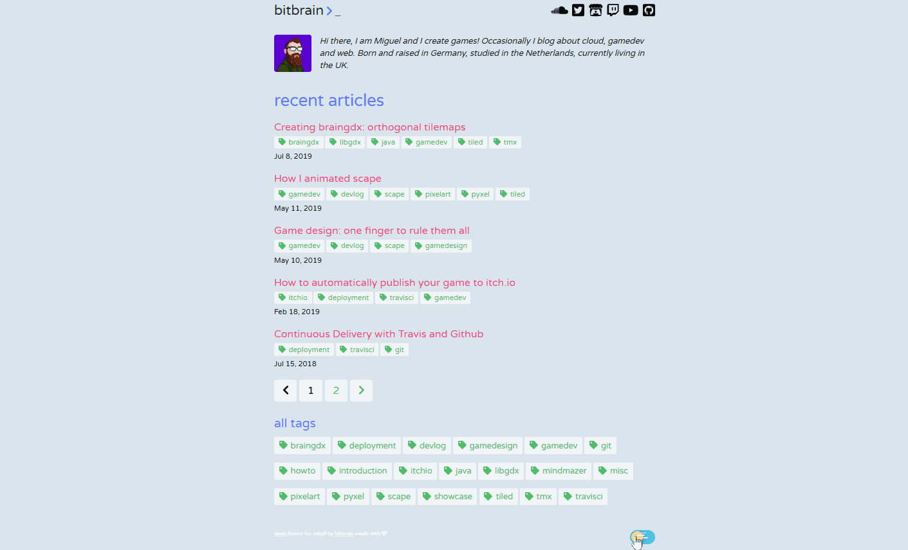

--

A dark and light theme for Jekyll, inspired by Dash UI for Atom. 🌒☀

[](https://travis-ci.org/bitbrain/jekyll-dash)
[](LICENSE.MD)
---
This theme for [Jekyll](https://jekyllrb.com/) has been inspired by [dash-ui](https://atom.io/themes/dash-ui), a dark theme for [Atom](https://atom.io).

[](http://bitbrain.github.io)

## Installation

Add this line to your Jekyll site's `Gemfile`:

```ruby
gem "jekyll-dash"
```

And add this line to your Jekyll site's `_config.yml`:

```yaml
theme: jekyll-dash
```

And then execute:

    $ bundle

Or install it yourself as:

    $ gem install jekyll-dash

## Configuration

Add the following configuration to your site. Customise it to your needs!

```yaml
# required by disqus to display comments
url: https://your-site-url

# jekyll-paginate
paginate: 5
paginate_path: "/blog/page:num/"

# jekyll-tagging (optional)
tag_permalink_style: pretty
tag_page_layout: tag_page
tag_page_dir: tag

dash:
  date_format: "%b %-d, %Y"

  disqus:
    shortname: <your-discuss-shortname>

  # generate social links in footer
  # supported colors: green, red, orange, blue, cyan, pink, teal, yellow, indigo, purple
  social_links:
    - url: https://twitter.com/bitbrain_
      icon: twitter-square
      color: cyan
    - url: https://bitbrain.itch.io
      icon: itch-io
      color: red
    - url: https://github.com/bitbrain
      icon: github-square
      color: purple
```
## Using this theme directly on Github Pages

Please keep in mind that Github Pages does only support [a limited list of Jekyll plugins](https://help.github.com/en/articles/configuring-jekyll-plugins#default-plugins). You will be able to use this theme on Github Pages but some functionality might not be available, for example displaying tags. In order to use this theme to a full extend, you have to generate the `_site` externally, for example on [TravisCI](https://travis-ci.org). 

For example, you want to host your own blog on `https://<username>.github.io`. As a result, you require the following repositories:

* `blog` - contains the actual Jekyll sources ([see example](https://github.com/bitbrain/blog))
* `<username>.github.io` - contains generated webpage, pushed automatically via TravisCI ([see example](https://github.com/bitbrain/bitbrain.github.io))

You are not required to do this, but keep in mind that some functionality might not be available when using the Jekyll generator on Github directly!

## Additional Features

**Tagging** add the `jekyll/tagging` plugin to your `_config.yml` file to enable tagging. Do not forget to also add the following to your `Gemfile`:
```Gemfile
gem "jekyll-tagging"
```
**Gravatar** if you want to display your gravatar picture, add the `liquid-md5` to your `_config.yml` file. Do not forget to also add the following to your `Gemfile`:
```Gemfile
gem "liquid-md5"
```
## FAQ

> I have configured posts but no posts are showing?

**Solution:** You most probably forgot to configure [jekyll-paginate](https://jekyllrb.com/docs/pagination/) in your _config.yml! Make sure you have the correct configuration as described above!

> I have added the correct configuration for `jekyll-paginate` but it is now complaining about a missing `index.html` file. What do I do?

**Solution** pagination only works with HTML files! Markdown is not supported there. Simply rename your `index.md` into `index.html` - that should do the trick!

> I have configured Disqus via _config.yml but Disqus fails to load on the page? 

**Solution:** Make sure you configure the correct `url` within your `_config.yml`. Also make sure that your domain is trusted by Disqus. This can be configured within Disqus by adding a trusted domain.

> I am using this theme but I don't see any tags?

**Solution**: as described above you have to add the tagging plugin. Additionally, tags do not work natively by Github Pages. You have to build your site on an external CI and push the `_site` artifacts to a hosting repository.

## Contributing

Bug reports and pull requests are welcome on GitHub at https://github.com/bitbrain/jekyll-dash. This project is intended to be a safe, welcoming space for collaboration, and contributors are expected to adhere to the [Contributor Covenant](http://contributor-covenant.org) code of conduct.

## Development

To set up your environment to develop this theme, run `bundle install`.

Your theme is setup just like a normal Jekyll site! To test your theme, run `bundle exec jekyll serve` and open your browser at `http://localhost:4000`. This starts a Jekyll server using your theme. Add pages, documents, data, etc. like normal to test your theme's contents. As you make modifications to your theme and to your content, your site will regenerate and you should see the changes in the browser after a refresh, just like normal.

When your theme is released, only the files in `_layouts`, `_includes`, `_sass` and `assets` tracked with Git will be bundled.
To add a custom directory to your theme-gem, please edit the regexp in `jekyll-dash.gemspec` accordingly.

## License

The theme is available as open source under the terms of the [Apache License 2.0](https://opensource.org/licenses/Apache-2.0).
