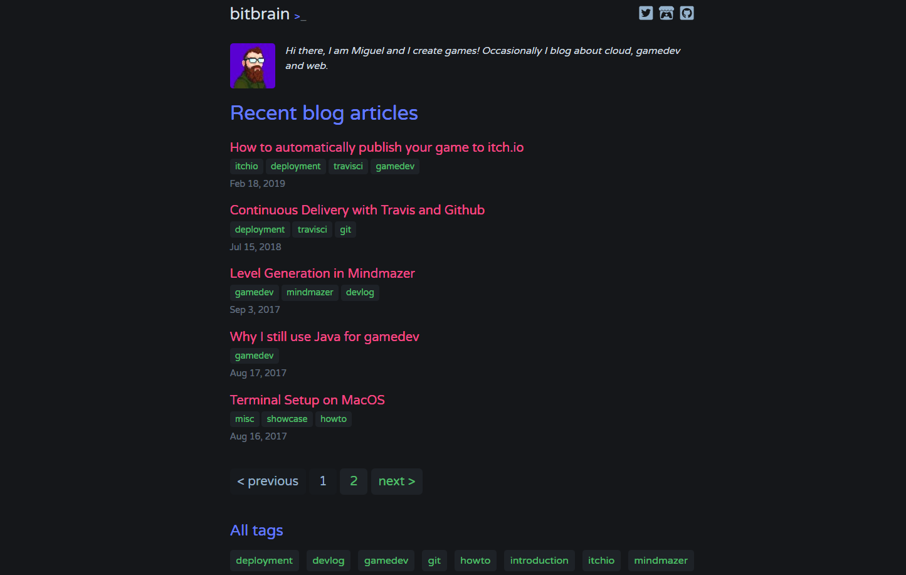

--

A dark theme for Jekyll, inspired by Dash UI for Atom. 🌒

[](https://travis-ci.org/bitbrain/jekyll-dash)
[](LICENSE.MD)
---
This theme for [Jekyll](https://jekyllrb.com/) has been inspired by [dash-ui](https://atom.io/themes/dash-ui), a dark theme for [Atom](https://atom.io).

[](http://bitbrain.github.io)

## Installation

Add this line to your Jekyll site's `Gemfile`:

```ruby
gem "jekyll-dash"
```

And add this line to your Jekyll site's `_config.yml`:

```yaml
theme: jekyll-dash
```

And then execute:

    $ bundle

Or install it yourself as:

    $ gem install jekyll-dash

## Configuration

Add the following configuration to your site. Customise it to your needs!

```yaml
# required by disqus to display comments
url: https://your-site-url

# jekyll-paginate
paginate: 5
paginate_path: "/blog/page:num/"

# jekyll-tagging (optional)
tag_permalink_style: pretty
tag_page_layout: tag_page
tag_page_dir: tag

dash:
  date_format: "%b %-d, %Y"

  disqus:
    shortname: <your-discuss-shortname>

  # generate social links in footer
  # supported colors: green, red, orange, blue, cyan, pink, teal, yellow, indigo, purple
  social_links:
    - url: https://twitter.com/bitbrain_
      icon: twitter-square
      color: cyan
    - url: https://bitbrain.itch.io
      icon: itch-io
      color: red
    - url: https://github.com/bitbrain
      icon: github-square
      color: purple
```

## Additional Features

**Tagging** add the `jekyll/tagging` plugin to your `_config.yml` file to enable tagging. Do not forget to also add the following to your `Gemfile`:
```Gemfile
gem "jekyll-tagging"
```
**Gravatar** if you want to display your gravatar picture, add the `liquid-md5` to your `_config.yml` file. Do not forget to also add the following to your `Gemfile`:
```Gemfile
gem "liquid-md5"
```
**

## Contributing

Bug reports and pull requests are welcome on GitHub at https://github.com/bitbrain/jekyll-dash. This project is intended to be a safe, welcoming space for collaboration, and contributors are expected to adhere to the [Contributor Covenant](http://contributor-covenant.org) code of conduct.

## Development

To set up your environment to develop this theme, run `bundle install`.

Your theme is setup just like a normal Jekyll site! To test your theme, run `bundle exec jekyll serve` and open your browser at `http://localhost:4000`. This starts a Jekyll server using your theme. Add pages, documents, data, etc. like normal to test your theme's contents. As you make modifications to your theme and to your content, your site will regenerate and you should see the changes in the browser after a refresh, just like normal.

When your theme is released, only the files in `_layouts`, `_includes`, `_sass` and `assets` tracked with Git will be bundled.
To add a custom directory to your theme-gem, please edit the regexp in `jekyll-dash.gemspec` accordingly.

## License

The theme is available as open source under the terms of the [MIT License](https://opensource.org/licenses/MIT).
